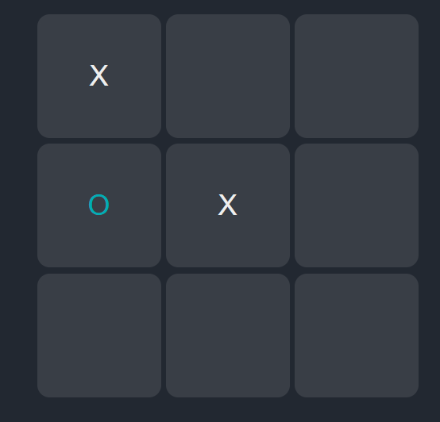

# Tic-Tac-Toe Game

A simple and interactive implementation of the classic Tic-Tac-Toe game using HTML, CSS, and JavaScript. In this project is a practical exercise in web development, showcasing fundamental concepts such as DOM manipulation, event handling, and game logic.

## Features

- **Dynamic Game Board:** The game dynamically creates a board based on the specified size, allowing for customizable gameplay.
- **Player Interaction:** Players take turns to make moves by clicking on empty cells, with visual feedback on their selected symbols.
- **Winning Conditions:** The game checks for winning conditions in rows, columns, and diagonals, highlighting the winning sequence.
- **Player vs. AI:** Enjoy playing against a simple AI that makes random moves in the single-player mode.
- **Responsive Design:** The interface is designed to be responsive, providing an optimal viewing experience on various devices.

## How to Play

1. Specify the size of the board and choose a game mode (Player vs. Player or Player vs. AI).
2. Click on empty cells to make your moves.
3. Win the game by forming a sequence of three symbols in a row, column, or diagonal.
4. If the board is filled with no winner, the game is declared a draw.

## Project Structure

- `index.html`: The main HTML file containing the structure of the web page.
- `styles.css`: CSS file for styling the game interface.
- `script.js`: JavaScript file with the game logic and event handling.
- `README.md`: Documentation providing an overview of the project, usage instructions, and reflections.

## Usage

1. Clone the repository: `git clone https://github.com/jrogeriosilva/tic-tac-toe-game.git`
2. Open `index.html` in a web browser.

Feel free to explore, contribute, or use this project.
